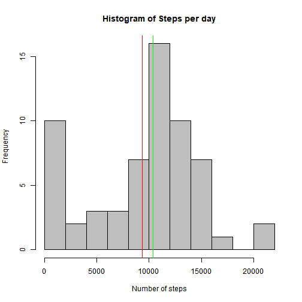
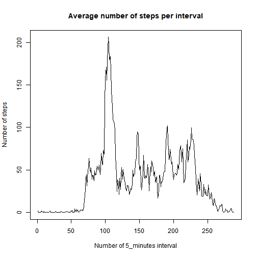
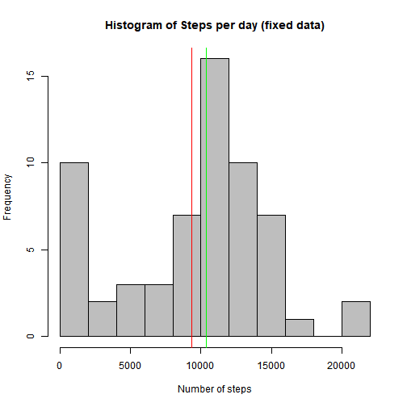
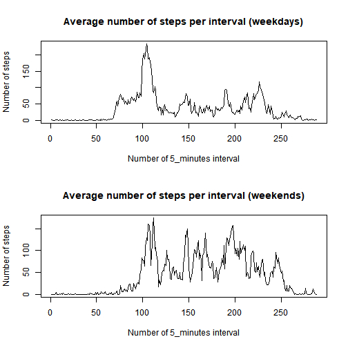

It is now possible to collect a large amount of data about personal movement using activity monitoring devices such as a Fitbit, Nike Fuelband, or Jawbone Up. These type of devices are part of the “quantified self” movement – a group of enthusiasts who take measurements about themselves regularly to improve their health, to find patterns in their behavior, or because they are tech geeks. 

In this document we will study a data which consists of two months of data from an anonymous individual collected during the months of October and November, 2012 and include the number of steps taken in 5 minute intervals each day.


## Question 1
### Reading the data

We've pulled repository containing the data from GITHub.
Let's read it!


```r
activity_data <- read.csv("activity.csv",header = TRUE)
```


## Question 2
### Steps taken per day

How many steps are taken per each day. We will use tapply functions to calculate total number of steps per each of 61 days presented in the data.


```r
num_steps_per_day <- with(activity_data, tapply(steps, date, sum, na.rm = TRUE))
head(num_steps_per_day)
```

```
## 2012-10-01 2012-10-02 2012-10-03 2012-10-04 2012-10-05 2012-10-06 
##          0        126      11352      12116      13294      15420
```

Let's plot a histogram to better understand data:



Vertical green line is a median value of histogram and red line is a mean value.


Median value is 10395 and mean value is 9354.

## Question 3
### Average daily activity pattern

What about average number of steps taken within each 5-minutes interval? Factorizing interval column would help us calculate mean value.

```r
activity_data$interval <- factor(activity_data$interval)
num_steps_interval_mean <- with(activity_data, tapply(steps, interval, mean, na.rm = TRUE))
```


Output plot:

On average maximum steps are taken in interval number 104 which corresponds to time interval
520 - 515 minutes.

## Question 4
### Imputing missing values

There are many missing values in dataset's steps column. We need to replace them by some reasonable values.
For this research we choose to replace NA's by average number of steps calculated in previous question.

How many NA's there are in dataset?


```r
sum(is.na(activity_data$steps))
```

```
## [1] 2304
```

To replace NA's accordingly we introduce function fix_NAs and apply it to dataset using mapply function.
Here is the function:

```r
fix_NAs <- function(x,y){
    if (is.na(x)) {
        return(num_steps_interval_mean[y])
     }
    else {
        return(x)
    }
}
```

Applying mapply and assigning result to a new dataset:

```r
fixed_activity_data <- activity_data
fixed <- mapply(fix_NAs,as.numeric(activity_data$steps),as.numeric(activity_data$interval))
fixed_activity_data$steps <- fixed
```


Does this fix changed mean and median values of number of steps taken each day?


Before fixing the data.


After fixing the data.


Vertical green line is a median value of histogram and red line is a mean value.

Median value is 10395 and mean value is 9354.

Imputing NA's changed the median and the mean.

## Question 5
### Difference in activity patterns between weekdays and weekends.

To study difference in activity between weekdays and weekends let's introduce wfactor - a factor of 2 levels:
"weekday" and "weekend"


```r
activity_data$wfactor <- factor(wday(ymd(activity_data$date)))
activity_data$wfactor <- revalue(activity_data$wfactor, c("1" = "weekend", "7" = "weekend", "2" = "weekday", "3" = "weekday", 
                                 "4" = "weekday", "5" = "weekday", "6" = "weekday"))
```

Let's split dataset by this factor and calculate average daily activity pattern for each factor.


```r
weekend_data <- filter(activity_data, wfactor == "weekend")
weekend_steps_interval_mean <- with(weekend_data, tapply(steps, interval, mean, na.rm = TRUE))

weekday_data <- filter(activity_data, wfactor == "weekday")
weekday_steps_interval_mean <- with(weekday_data, tapply(steps, interval, mean, na.rm = TRUE))
```



Not a surprise we see higher activity if weekdays. Possibly this individual has an office job.
We also see that activity in weekends starts later in comparison to weekdays.
